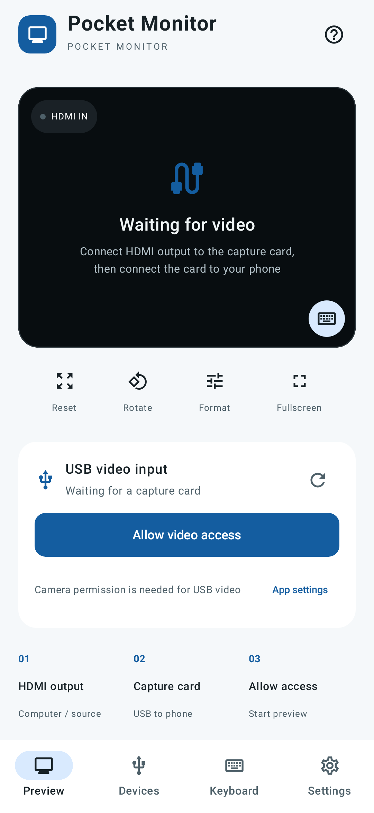
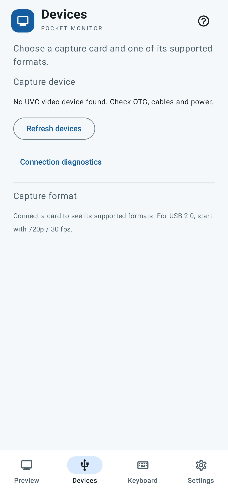
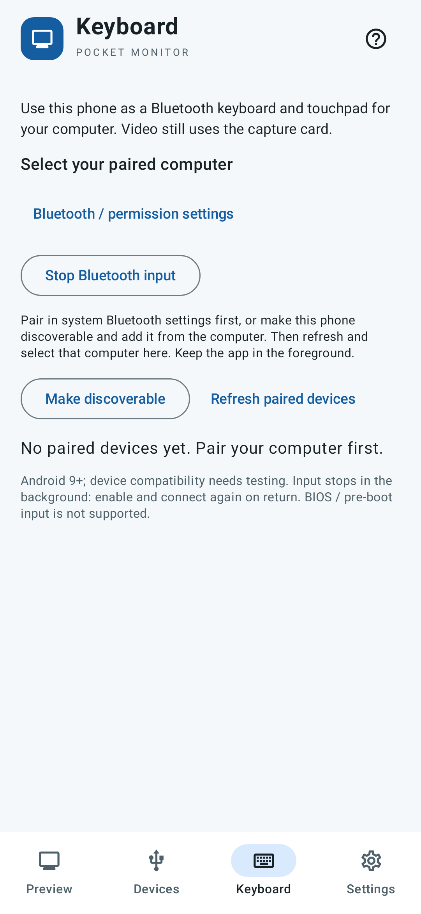
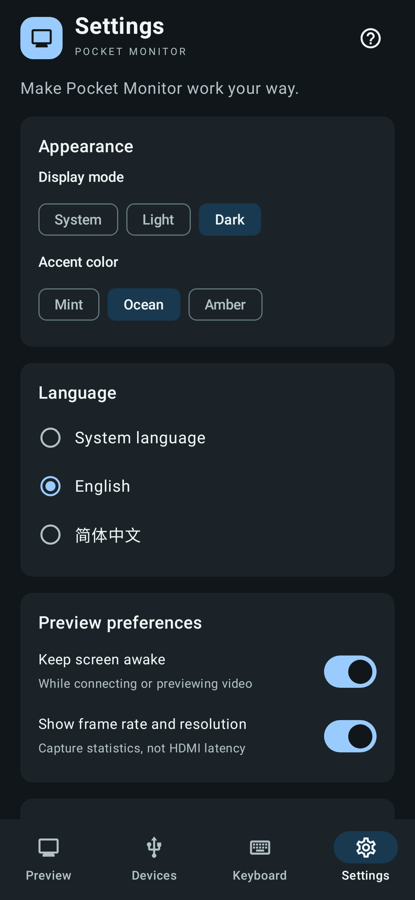

<h1 align="center">Pocket Monitor · 随身屏</h1>

<p align="center"><strong>View your computer’s HDMI output on your Android phone.</strong></p>
**English** · [简体中文](README.zh-CN.md)

**[Download Android APK](https://github.com/ttermish/pocket-monitor/releases/download/v0.1.5/pocket-monitor-0.1.5-release.apk)** · [Screenshots](#preview) · [Quick start](#quick-start) · [Documentation](docs/README.md) · [Report an issue](https://github.com/ttermish/pocket-monitor/issues/new/choose)

Pocket Monitor is a portable video monitor app. Connect your computer’s HDMI output to a USB video capture card, then connect the card to your phone to preview the picture. No sender software is needed on the computer.

Use your phone as a temporary small display to check another computer’s video output. The current **0.1.5 development build supports Android 8.0 and later**. Individual phone and capture-card combinations still need hardware testing.

## Preview

| Preview | Devices | Keyboard | Settings |
| :---: | :---: | :---: | :---: |
| [](docs/images/preview-en.png) | [](docs/images/devices-en.png) | [](docs/images/input-en.png) | [](docs/images/settings-en.png) |

[View screenshots individually](docs/images/README.md). The repository and images are public; no sign-in is required. For offline viewing, [download the documentation archive](https://github.com/ttermish/pocket-monitor/releases/download/v0.1.5/pocket-monitor-0.1.5-docs.zip) and extract it so `docs/images/` stays alongside the README.

**Preview · Devices · Keyboard · Settings.** These screenshots are rendered from the actual app UI, with no capture card or computer connected. The Keyboard screenshot uses a simulated ready state. They show light and dark appearances; real HDMI capture still needs hardware validation.

## What you can do

- **Preview HDMI video:** receive a computer or other device’s picture through a UVC capture card.
- **Inspect details:** pinch to zoom, drag the picture, switch to fullscreen or rotate in 90° steps.
- **Choose a capture format:** select a resolution and frame rate reported by your card.
- **Remember a working format:** after at least three seconds of continuous frames, save the format for that card model and prefer it next time.
- **Personalize the app:** light, dark or system appearance; Mint, Ocean or Amber colors; English, 简体中文 or system language. Preferences are saved automatically.
- **Keep video local:** no video recording or uploading. Capture stops in the background and attempts to resume when you return.

**New in v0.1.5:** Bluetooth ANSI keyboard and touchpad support on Android 9+. Audio, recording, screenshots and an iPhone app are not available.

## What you need

| Item | Requirements |
| --- | --- |
| Android phone | Android 8.0+, with USB Host / OTG support. Some phones require enabling OTG in system settings. |
| UVC video capture card | HDMI IN connects to the computer; USB connects to the phone. |
| HDMI and data cables | Use an OTG adapter if needed and a USB cable that supports data transfer. |
| HDMI source | A computer or other device with HDMI output. USB-C-only computers need an adapter that supports video output. |

**A regular USB-C-to-HDMI display cable is not a capture card.** The capture card converts HDMI input into USB video the phone can read.

## Install

[Download the signed Android APK](https://github.com/ttermish/pocket-monitor/releases/download/v0.1.5/pocket-monitor-0.1.5-release.apk) · [Release notes, source and checksums](https://github.com/ttermish/pocket-monitor/releases/tag/v0.1.5)

The APK is publicly downloadable without signing in. Developers can also use the [build guide](docs/DEVELOPMENT.en.md).

| File | What it is for |
| --- | --- |
| `*-release.apk` | Install on your Android phone. |
| `*-release.aab` | Store distribution; cannot be installed directly. |
| [`*-source.zip`](https://github.com/ttermish/pocket-monitor/releases/download/v0.1.5/pocket-monitor-0.1.5-source.zip) | Source code and complete documentation, including screenshots. |
| [`*-docs.zip`](https://github.com/ttermish/pocket-monitor/releases/download/v0.1.5/pocket-monitor-0.1.5-docs.zip) | Offline bilingual guides and screenshots. Extract before reading. |
| `SHA256SUMS` | Check downloaded file integrity. See the [download guide](docs/DOWNLOADS.md). |

If a newly pushed tag only shows **Source code**, its release build has not published the APK yet. Wait for **Android Release** to finish, then download the `.apk` under **Assets** or use the APK link above.

Open the APK on your phone and allow installation from that source when prompted. Release packages use a dedicated signing key; local Debug packages use a different signature. A Release APK cannot update an existing Debug installation directly. Uninstalling the previous version clears saved capture formats. An AAB is intended for store distribution and cannot be installed directly.

## Quick start

### 1. Connect your computer, capture card and phone

```text
Computer HDMI OUT → HDMI cable → Capture card HDMI IN
                                      │
                                  USB / OTG
                                      │
                                 Android phone
```

Connect the HDMI side to the video source and the USB side to your phone. Make sure the computer is outputting a picture and OTG is enabled if your phone requires it.

### 2. Open Pocket Monitor and allow access

Tap **Allow video access** and grant camera permission. Once a device is found, tap **Connect capture card** and allow access in the system USB dialog. If no device appears, tap refresh or **Find capture card**.

With multiple capture cards attached, choose one in **Devices**. Start with just one card to make the input easy to identify.

### 3. Set your computer’s display output

On a Mac, open **System Settings → Displays**. Choose mirroring to see the same desktop on your phone. With an extended display, move a window to the new display.

Start by trying a 1920 × 1080, 60 Hz computer output and the app’s preferred 720p / 30 fps MJPEG capture format. HDMI output and USB capture settings can differ; available formats depend on the card.

## Adjust the picture

| Action | How to use it |
| --- | --- |
| Fullscreen | Tap **Fullscreen**; use the top-right button to exit. |
| Rotate | Each tap on **Rotate** rotates the picture by 90°. |
| Zoom and pan | Pinch in the preview, then drag to inspect details. |
| Reset | Double-tap the picture to reset zoom and position. **Reset** also resets rotation. |
| Change format | Once connected, open **Devices** and choose a supported resolution, frame rate and encoding. |
| Stop | Tap **Stop preview**, or disconnect in **Devices**. |

**Format switching in v0.1.5:** changing capture format now destroys the old native camera, clears the video Bulk IN endpoint if present, then recreates the camera with the requested format while keeping the authorized USB connection. Selecting the current live or waiting format leaves the stream running. While waiting for frames, use Stop preview to cancel; repeated connection requests for the same active card do not restart the startup timer. Startup failures still use the bounded lower-format reconnects described below; hardware confirmation is pending.

**Known unresolved issue:** on the reported OPPO PLG110 / Android 16 with UGREEN 95348 (`2b89:5348`), switching from a working 720p mode can stop frames, and falling back may still require unplugging and reconnecting. Advertised modes do not prove usable capture; this release does not claim to fix that failure.

Higher settings are not always smoother: USB bandwidth, the card and phone power all matter. The app prefers MJPEG close to 720p / 30 fps. Working formats are remembered by card model, so identical models share the setting.

## Make it yours

Open the **Settings** tab to choose **System / Light / Dark** appearance and a **Mint / Ocean / Amber** accent. Change **Language** to English, 简体中文 or System language; the interface updates immediately. Unsupported system languages use English.

You can turn off **Keep screen awake** or hide **frame rate and resolution**. These settings stay on your phone and survive app restarts. **About → Open-source licenses** displays the bundled third-party notices offline.

The four tabs separate preview controls, capture devices, Bluetooth input and app preferences. Switching tabs keeps the preview surface mounted; the app still opens only one capture card at a time. Going to the background stops capture.

## Use your phone as a keyboard and touchpad

Open **Keyboard → Enable keyboard**. Allow Nearby devices on Android 12+, and turn on Bluetooth. Pair your computer in system Bluetooth settings, then return and enable the keyboard again. Alternatively, choose **Make discoverable** and add the phone from the computer. Refresh the paired-device list and select your computer explicitly.

The keyboard uses a 104-key ANSI layout with punctuation, Caps Lock, F1–F12, navigation and an optional number pad. Left/right Shift, Ctrl, Option/Alt and Command/Win are independent. Swipe the whole keyboard sideways or use landscape. In tap mode, select modifier chips for a one-shot shortcut; keycaps send a press/release pair. Enable **Hold keys** to hold keys with your fingers, including up to six ordinary keys plus eight modifiers. **Release all** clears held keys and queued input. **Send text** accepts up to 200 ASCII characters using US keyboard positions; choose a matching host layout and turn Caps Lock off. For Chinese, use the computer's input method. Switch to **Touchpad** to move the pointer, tap or use left/right-click and scroll buttons. The keyboard button on the preview opens these controls over the picture.

**Mac keyboard setup:** open the in-app setup hint. If the assistant asks for the key beside left Shift, use Z; beside right Shift, use /. Follow the exact prompt and select ANSI (US) if asked. This layout does not emulate Apple-specific Fn/Globe or Touch ID; completing the assistant still needs Mac hardware verification.

Requires **Android 9+**, phone support for Bluetooth HID Device and a computer that supports Bluetooth keyboards. Video and Bluetooth compatibility still need hardware testing. The app needs no computer-side companion software. Input stops on leaving the foreground, and returning requires enabling and connecting again. BIOS/pre-boot input, direct Chinese/emoji text transfer and USB keyboard emulation are not supported. Enabling Android HID Device can temporarily disconnect Bluetooth input devices connected to the phone.

## Troubleshooting

**No capture card found:** check OTG, the data cable, adapters and power. Make sure this is a UVC capture card; a regular display cable cannot receive video.

**Access was denied:** tap the permission button again. If Android no longer prompts, open **App settings**, allow camera access, then reconnect and allow USB access.

**Desktop wallpaper appears but browser or app windows are missing:** the computer may be using an extended desktop. On Mac, open System Settings → Displays, select the external display and choose mirroring under Use as. On Windows, press Win + P → Duplicate. Alternatively, keep extended mode and move the window to the capture-card display.

**The device cannot be opened:** close other apps using the card, unplug it and reconnect.

**Color bars or black video with a “live” indicator:** some cards generate their own no-signal picture. Receiving frames does not prove the computer is outputting correctly. Check HDMI, display settings and power. HDCP-protected content is outside the supported scope.

**Waiting for frames or an interrupted stream:** after eight seconds without startup frames, the app tries up to two lower-format reconnects. If that fails, check the wiring or choose a format manually in **Devices**. A stream that stops after producing frames will not repeatedly reconnect automatically.

**Repeated USB dialogs or formats that require unplugging to recover:** v0.1.5 automatically reconnects only after USB access is granted, to avoid racing Android's attach dialog. If access is not granted, tap Connect capture card. Reproduce the failure in v0.1.5, open **Devices → Connection diagnostics → Copy diagnostics**, and include the report with your feedback. It records phone/version, advertised modes, connection stages, USB link speed/endpoints, Bulk stop results and a bounded excerpt of this process's native UVC logs, with no video or keyboard input and no automatic upload.

**Capture stops in the background:** this is expected. Capture runs only while the app is in the foreground and attempts to resume on return. Reconnect manually if needed.

## Feedback and contribution

[Open an issue](https://github.com/ttermish/pocket-monitor/issues) with your phone model, Android version, capture-card model, selected format and reproduction steps. Reports from real hardware are welcome. Remove personal information from logs and screenshots before sharing.

Project licensing is awaiting the owner’s choice; a root project LICENSE has not been added yet. Third-party licenses are listed separately below.

- [Documentation index](docs/README.md)
- [Privacy](docs/PRIVACY.md) · [Hardware compatibility](docs/COMPATIBILITY.md) · [Roadmap](docs/ROADMAP.md)
- [Contributing](CONTRIBUTING.md) · [Security reports](SECURITY.md)
- [Development and builds](docs/DEVELOPMENT.en.md) · [Development conventions (中文)](AGENTS.md)
- [Changelog (中文)](CHANGELOG.md) · [Validation record (中文)](docs/VALIDATION.md)
- [Third-party components and licenses](THIRD_PARTY_NOTICES.md) · [Release preparation (中文)](docs/RELEASING.md)
