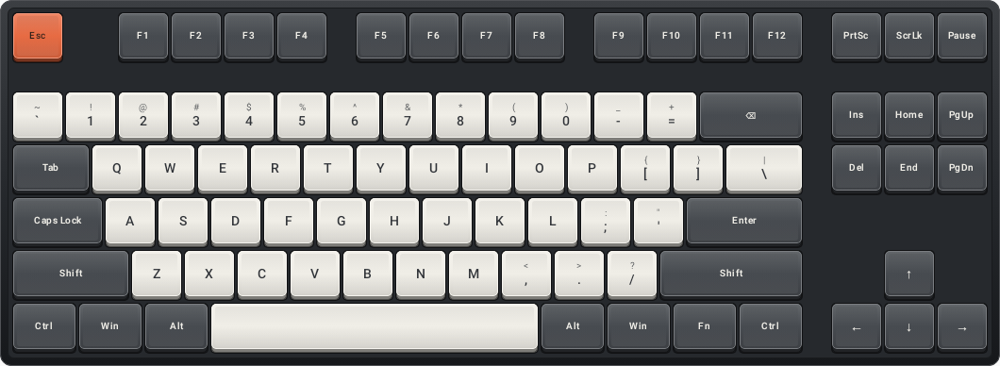
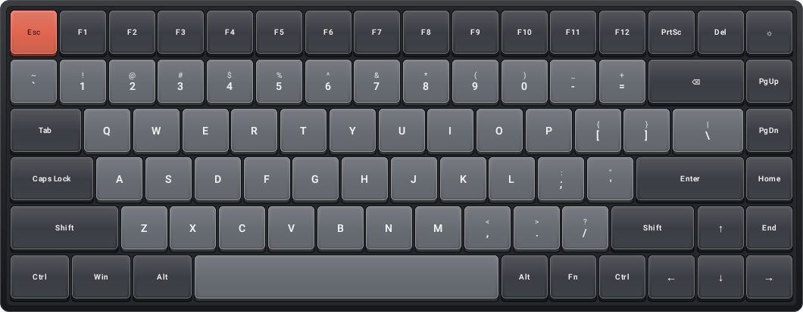
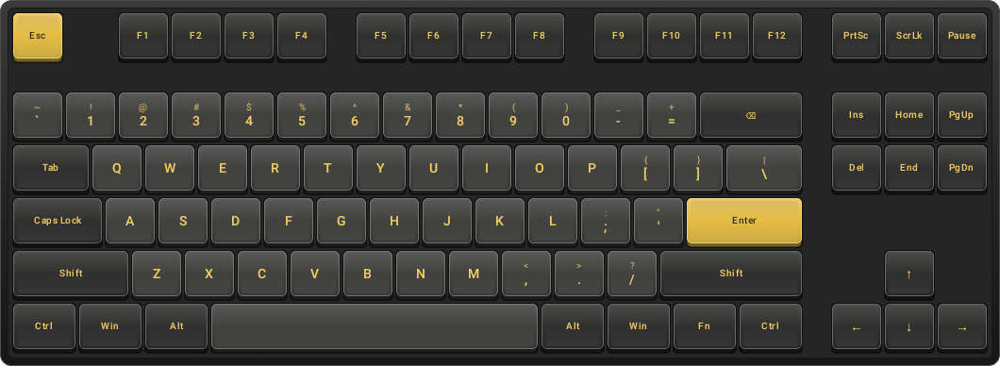
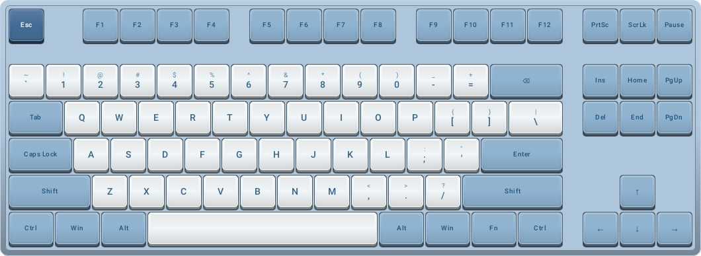

# 实体键盘布局与主题 / Physical keyboard layouts and themes

键鼠页可分别选择布局和配色。布局、主题与按键震动偏好保存在手机上，预览快捷面板与键鼠页共用。点击「全屏键盘」可专注输入；横屏更适合显示整把键盘。

Choose the physical layout and color theme independently on the Keyboard page. Layout, theme and vibration settings are saved on the phone and shared with the preview input panel. **Fullscreen keyboard** offers a dedicated typing view; landscape gives the board more room.

## 布局 / Layouts

| 布局 | 键数 | 实体位置与尺寸 |
| --- | --- | --- |
| ANSI TKL | 87 | F1–F4 / F5–F8 / F9–F12 分组，右侧独立六键导航区，倒 T 方向键；右 Shift 2.75u，空格 6.25u |
| Keychron K2 ANSI | 84 | 连续 F 区，右侧 PgUp / PgDn / Home / End，右 Shift 1.75u；底排含 Fn，空格 6.25u |

u 表示实体键位间距。采用统一坐标排列，不按每行单独均分宽度；开启「整板显示」会等比例缩放。关闭后保留较大的键位并左右滑动。数字键盘仍可单独展开，不计入 84/87 键主板。

The board uses uniform key-pitch coordinates, including physical gaps and wider keys. **Show whole keyboard** scales the complete board; turn it off for larger keys and horizontal scrolling. The optional number pad is separate from the 84/87-key board.

## 主题预览 / Theme previews

以下图片来自实际 Compose 界面自动化渲染，使用模拟连接状态，没有生成键盘照片，也不代表蓝牙或 HDMI 真机验收。

These images are rendered from the actual Compose UI with simulated connection state. They do not demonstrate hardware Bluetooth or HDMI validation.

| C1 黑白 / Ivory · 87 | K2 灰红 / Graphite · 84 |
| --- | --- |
|  |  |
| Akko 黑金 / Black & Gold · 87 | Varmilo 海韵 / Sea · 87 |
|  |  |

布局与配色参考如下官方资料；界面使用自行绘制的键帽、文字和材质，不包含品牌标志或原产品装饰插画。配色可应用到任一种布局。

The following official references guide the geometry and color palettes. Keycaps, legends and surfaces are drawn in the app; brand logos and product illustrations are not included. Every theme works with either layout.

- [Keychron C1 ANSI layout and keycap sizes](https://www.keychron.com/pages/c1-keycap-layout-and-keycap-size-hd-picture)
- [Keychron K2 ANSI layout and keycap sizes](https://www.keychron.com/pages/keychron-k2-keyboard-keycaps-layout-and-keycap-size-hd-picture)
- [Akko Black & Gold 5087B Plus](https://en.akkogear.com/product/blackgold-5087b-plus-mechanical-keyboard/)
- [Varmilo Sea Melody](https://varmilo.com/products/sea_melody)

## 点击与按住 / Tap and hold

- 点击普通键发送一次按下/松开；点按 Ctrl、Shift、Alt 或 Win/Command 键帽会选中并亮起，下一次普通键带上这些修饰键，发送后清除。选择条也可设置左右修饰键。
- 「按住模式」在手指落下时按下，抬起或取消时松开，保留多指输入；切换布局、关闭全屏或退出输入面板会清理输入。
- 键帽在固定触摸区域内下沉，阴影收缩，松开回弹；触摸取消也恢复。每次按下产生一次可关闭的轻触反馈。实际震动受手机设置和硬件支持影响。
- Fn 是应用内导航层：← / → / ↑ / ↓ 对应 Home / End / PgUp / PgDn，退格对应 Del，Del 对应 Ins。按住 Fn 和另一键时，即使先松开 Fn，仍松开原来发送的键。「松开所有键」也清除 Fn 层。
- K2 灯光键切换界面键位灯效。这些本地控制不发送非法 HID 键值，也不模拟实体品牌的媒体键固件、设备切换或 RGB 通信协议。

Tap ordinary keys to send a press/release pair. Tap modifier keycaps to latch them for one shortcut; their caps highlight until the next ordinary key. **Hold keys** supports multiple fingers with release on lift or cancellation. Switching layouts, closing fullscreen or leaving the input panel clears input. The app-local Fn layer maps arrows to navigation keys and preserves the originally pressed usage until release. The K2 lamp toggles visual lighting. Haptics follow device support and settings; brand-specific firmware and RGB protocols are not emulated.

## 复现截图 / Reproduce screenshots

`KeyboardAppearanceTest.renderAllPhysicalThemesAndPressedKeyFromActualUi` 渲染四种配色与按压状态，输出到 `androidApp/build/reports/screenshots/`。截图是 UI 测试产物；真实震动、电脑收键与多指触摸仍需手机验证。
